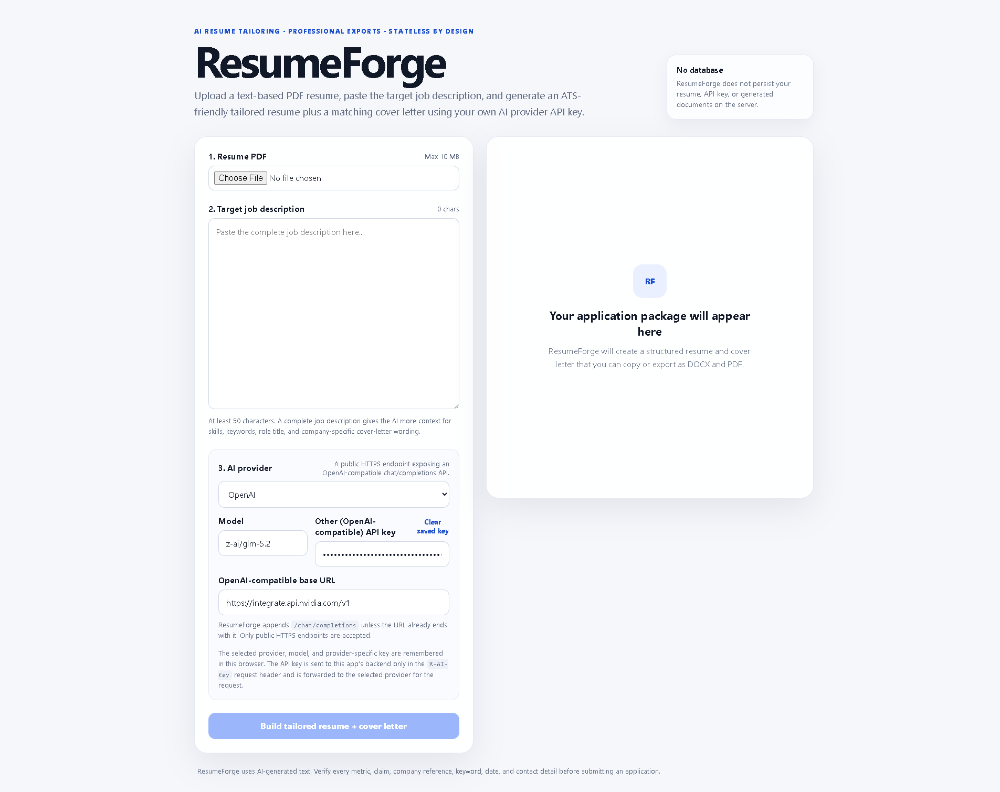
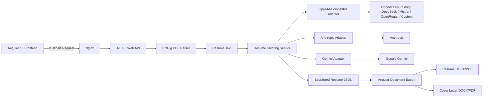

# ResumeForge


> AI-powered, multi-provider resume tailoring built with **.NET 8**, **Angular 18**, **Docker**, and modern LLM integrations.



## 🎥 Demo


> *The GIF shows a complete workflow: uploading a PDF, pasting a Job Description, generating the tailored resume, and downloading the result.*

ResumeForge helps users tailor an existing PDF resume to a target job description, generate a professional summary and rewritten experience bullets, create a tailored cover letter, and export the final result as **DOCX**, **PDF**, or plain text.

The project is designed as a **stateless, Bring-Your-Own-Key (BYOK)** application. ResumeForge does not maintain a user database or persist resumes, job descriptions, API keys, or generated documents on the server.

If ResumeForge is useful to you, please consider giving the repository a **GitHub Star ⭐**.

---

## Features

- PDF resume upload
- Job-description based tailoring
- PdfPig text extraction
- Scanned/image-only PDF detection
- Professional summary generation
- Rewritten experience bullets
- Tailored cover letter
- ATS-friendly Resume DOCX/PDF export
- Cover Letter DOCX/PDF export
- One-click copy
- Multi-provider AI support
- Custom OpenAI-compatible provider support
- Stateless backend
- Docker and Docker Compose
- GitHub Actions CI
- SSRF protection for custom provider endpoints

---

## Supported AI Providers

ResumeForge supports:

- OpenAI
- Anthropic / Claude
- Google Gemini
- xAI / Grok
- Groq
- DeepSeek
- Mistral
- OpenRouter
- Other OpenAI-compatible APIs

Users choose the provider, model, and API key directly in the application.

### Need an API key?

Some providers currently offer free, trial, or developer access.

See the dedicated guide:

**[AI Provider API Keys & Free/Trial Options](docs/AI_API_KEYS.md)**

> Provider pricing, free tiers, models, and rate limits can change. Always verify current details on the provider's official website.

---

## Custom AI Provider

Selecting **Other (OpenAI-compatible)** reveals:

```text
Base URL
Model
API Key
```

ResumeForge then calls:

```text
POST {BASE_URL}/chat/completions
```

Custom endpoints must use public HTTPS and pass server-side SSRF validation.

---

## Architecture



---

## Engineering Highlights

### Provider Abstraction

AI integrations are separated behind provider-specific adapters instead of coupling resume-generation logic directly to one vendor.

```text
IAiProviderGateway
│
├── OpenAiCompatibleProviderClient
│   ├── OpenAI
│   ├── xAI
│   ├── Groq
│   ├── DeepSeek
│   ├── Mistral
│   ├── OpenRouter
│   └── Custom OpenAI-compatible APIs
│
├── AnthropicProviderClient
│
└── GeminiProviderClient
```

### Stateless Backend

There is no application database. Resume files, job descriptions, API keys, and generated results are processed for the active request and are not intentionally persisted by ResumeForge.

### BYOK Security Model

Users supply their own AI API keys. Keys are request-scoped on the backend and are not stored in server configuration or a database.

### SSRF Protection

Custom provider endpoints are restricted to public HTTPS destinations and private/localhost destinations are blocked.

### ATS-Friendly Document Generation

ResumeForge generates clean, single-column documents with selectable text and clear section hierarchy rather than visually complex layouts that may reduce ATS parsing reliability.

---

## Technology Stack

### Backend

- .NET 8
- ASP.NET Core Web API
- Controllers
- Dependency Injection
- `async` / `await`
- `IHttpClientFactory`
- PdfPig
- Provider adapter architecture
- Health checks

### Frontend

- Angular 18+
- Standalone Components
- Signals
- OnPush change detection
- Angular HttpClient
- localStorage
- Client-side DOCX/PDF generation

### Infrastructure

- Docker
- Docker Compose
- Nginx
- Multi-stage builds
- Custom Docker network
- Container health checks
- GitHub Actions

---

## Quick Start

### Prerequisites

- Docker
- Docker Compose
- Git
- API key from at least one supported AI provider

### Clone

```bash
git clone https://github.com/manjinder-dev/ResumeForge.git
cd ResumeForge
```

### Create local environment file

Linux/macOS:

```bash
cp .env.example .env
```

Windows PowerShell:

```powershell
Copy-Item .env.example .env
```

### Start

```bash
docker compose up -d
```

Open:

```text
http://localhost:4200
```

Backend:

```text
http://localhost:5000
```

Health endpoint:

```text
http://localhost:5000/health
```

Stop:

```bash
docker compose down
```

---

## Privacy

ResumeForge is stateless, but AI processing is **not local-only**.

ResumeForge does not intentionally persist uploaded resumes, job descriptions, generated documents, or API keys. However, extracted resume content and the job description are sent to the AI provider selected by the user.

Users should review the privacy and data-retention policies of their selected provider before submitting confidential information.

---

## Security

ResumeForge includes:

- No application database
- No server-side API-key persistence
- Request-scoped credentials
- Upload-size validation
- Job-description validation
- Scanned PDF detection
- No intentional request-body logging
- Provider-specific authentication handling
- HTTPS-only custom endpoints
- Private-network/localhost blocking
- Docker health checks

For public internet deployment, also add TLS termination, rate limiting, CSP, secret-redacted observability, abuse monitoring, and dependency scanning.

---

## AI Accuracy Warning

AI-generated resume content must be reviewed before use.

Always verify generated:

- numbers
- percentages
- monetary figures
- skills
- project claims
- achievements
- employer details

ResumeForge assists with writing; it should not be treated as a source of truth for professional history.

---

## Screenshots

For a public portfolio repository, add real screenshots under:

```text
docs/images/
```

Recommended screenshots:

1. Upload + provider selection
2. Generated resume preview
3. Resume PDF/DOCX output
4. Cover-letter preview
5. Custom provider configuration

---

## Contributing

Contributions are welcome.

Useful contribution areas include:

- AI provider adapters
- security improvements
- export templates
- tests
- accessibility
- UI/UX
- Docker improvements
- documentation
- bug fixes

Please read [`CONTRIBUTING.md`](CONTRIBUTING.md) before opening a pull request.

If ResumeForge is useful to you, a GitHub **Star ⭐** is appreciated, but never required to contribute.

---

## Other Projects

### CurieFit

**CurieFit** is a live fitness and nutrition platform featuring health calculators and AI-powered personalized diet/workout planning.

🌐 **https://curiefit.com**

CurieFit is a privately maintained product. Its source code is **not publicly available**.

---

## Author

**Manjinder Singh**

Software Engineer focused on:

- .NET / C#
- Angular
- Full-Stack Engineering & Architecture
- AI & LLM Integrations
- Agentic AI
- Docker
- Production Web Applications

### Other Projects

**CurieFit** — Live fitness and nutrition platform  
🌐 https://curiefit.com

> ResumeForge is an independent personal open-source project and is not
> affiliated with or endorsed by any employer or organization.
---

## Support the Project

If ResumeForge helped you:

- ⭐ Star the repository
- 🐛 Report bugs
- 💡 Suggest improvements
- 🤝 Submit pull requests
- 📣 Share the project

---

## License

ResumeForge is licensed under the **GNU Affero General Public License v3.0 (AGPL-3.0)**.

See [`LICENSE`](LICENSE).

---

## Disclaimer

ResumeForge does not guarantee interviews, employment, ATS acceptance, factual accuracy of AI-generated content, or compatibility with every provider/model.

Always review generated documents before submitting them to an employer.
